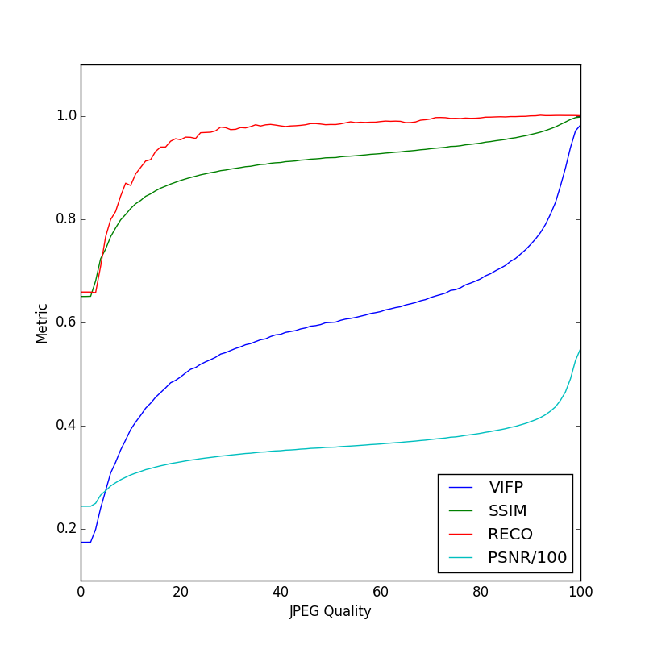
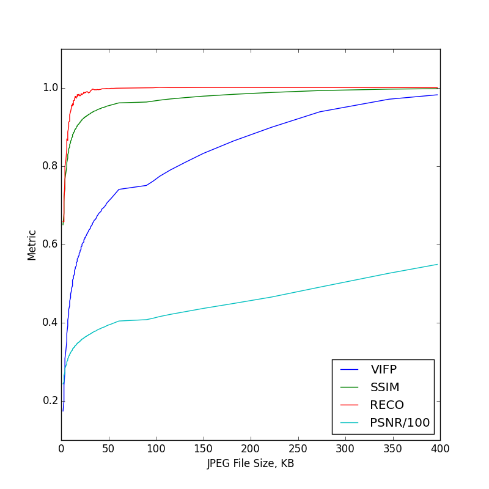

# Video Quality Metrics

Video quality metrics, reference implementation in python, with GPU optimizations and C versions as time permits.

- VIF (sometimes called VIF-P or VIFP), Visual Information Fidelity: implemented
- SSIM, Structural Similarity Metric: implemented
- PSNR, Peak Signal to Noise Ratio: implemented
- RECO, Relative Polar Edge Coherence: implemented
- NIQE, Natural Image Quality Evaluator: implemented
- MS-SSIM, MultiScale Structural Similarity Metric: planned
- 3SSIM, 3-Component Structural Similarity Metric: planned
- VQUAD-HD: planned
- VQM: maybe
- UIQ, Universal Image Quality: maybe
- MSSIM, Motion SSIM: maybe

## Example

Run the demo/jpg_demo.py script, which will compress lena.png with JPEG at every quality setting 0-100, and plot all metric values vs quality setting and vs file size.

## References

H. R. Sheikh and A. C. Bovik, “Image information and visual quality,” Image Processing, IEEE Transactions on, vol. 15, no. 2, pp. 430–444, 2006.

V. Baroncini, L. Capodiferro, E. D. Di Claudio, and G. Jacovitti, “The polar edge coherence: a quasi blind metric for video quality assessment,” EUSIPCO 2009, Glasgow, pp. 564–568, 2009.

Z. Wang, E. P. Simoncelli, and A. C. Bovik, “Multiscale structural similarity for image quality assessment,” Conference Record of the Thirty-Seventh Asilomar Conference on Signals, Systems and Computers, 2003, vol. 2, pp. 1398–1402.

Mittal, Anish, Rajiv Soundararajan, and Alan C. Bovik. "Making a completely blind image quality analyzer." Signal Processing Letters, IEEE 20.3 (2013): 209-212.
